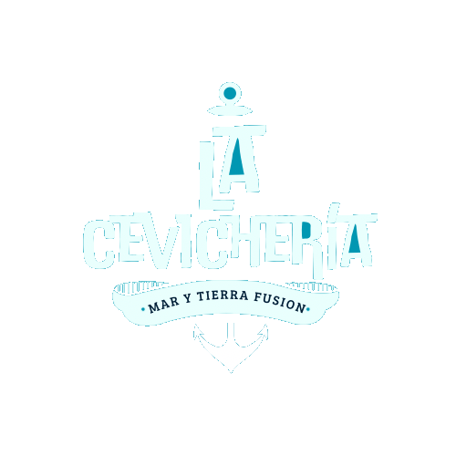

<p align="center">
  
</p>

<h1 align="center">La Cevichería — Mar y Tierra Fusión</h1>

<p align="center">
  Sitio web oficial de <strong>La Cevichería</strong>, restaurante de mariscos y cocina fusión salvadoreña.
  <br />
  Construido con <strong>React + TypeScript + Vite</strong>.
</p>

---

## 📋 Requisitos previos

Antes de iniciar, asegúrate de tener instalado en tu máquina con **Windows**:

| Herramienta | Versión mínima | Descarga |
|------------|---------------|----------|
| **Node.js** | v18 o superior | [nodejs.org](https://nodejs.org/) |
| **npm** | v9 o superior | Viene incluido con Node.js |
| **Git** | Cualquier versión reciente | [git-scm.com](https://git-scm.com/) |

> 💡 Al instalar Node.js, selecciona la opción **LTS** (Long Term Support) para mayor estabilidad.

---

## 🚀 Inicio rápido (Windows)

### 1. Clonar el repositorio

Abre **PowerShell**, **CMD** o **Git Bash** y ejecuta:

```bash
git clone https://github.com/NakanoNin/la-cevicheria.git
cd la-cevicheria
```

### 2. Instalar dependencias

```bash
npm install
```

Esto descargará todas las dependencias definidas en `package.json` dentro de la carpeta `node_modules/`.

### 3. Iniciar el servidor de desarrollo

```bash
npm run dev
```

Verás algo como:

```
  VITE v5.x  ready in 200ms

  ➜  Local:   http://localhost:5173/
```

### 4. Abrir en el navegador

Abre tu navegador y visita:

```
http://localhost:5173/
```

¡Listo! El sitio se recargará automáticamente cada vez que guardes un cambio en el código.

---

## 📦 Scripts disponibles

| Comando | Descripción |
|---------|-------------|
| `npm run dev` | Inicia el servidor de desarrollo con hot-reload |
| `npm run build` | Genera la versión de producción en la carpeta `dist/` |
| `npm run preview` | Previsualiza la build de producción localmente |

---

## 🐳 Docker (opcional)

Si prefieres usar Docker:

```bash
docker-compose up --build
```

El sitio estará disponible en `http://localhost:80`.

---

## 🗂️ Estructura del proyecto

```
la-cevicheria/
├── public/
│   └── assets/
│       ├── images/
│       │   ├── decorativos/     # Fondos decorativos
│       │   ├── logos/            # Logos de la marca
│       │   └── promociones/     # Fotos de platillos y promos
│       └── videos/              # Video del hero
├── src/
│   ├── components/
│   │   ├── FloatingMenu.tsx     # Menú de navegación flotante
│   │   ├── Hero.tsx             # Sección principal con video
│   │   ├── Platillos.tsx        # Carrusel de platillos destacados
│   │   ├── Promociones.tsx      # Carrusel auto-scroll de promos
│   │   ├── Nosotros.tsx         # Sección "Nosotros"
│   │   ├── Ubicacion.tsx        # Sucursales con enlace a mapa
│   │   ├── Postulaciones.tsx    # Sección de empleo
│   │   └── Footer.tsx           # Pie de página
│   ├── hooks/
│   │   └── useScrollFadeIn.ts   # Hook para animaciones al scroll
│   ├── styles/
│   │   ├── variables.css        # Tokens de diseño (colores, fuentes, etc.)
│   │   └── global.css           # Estilos globales y componentes
│   ├── App.tsx                  # Componente raíz
│   └── main.tsx                 # Entry point
├── index.html                   # HTML principal
├── vite.config.ts               # Configuración de Vite
├── tsconfig.json                # Configuración de TypeScript
├── package.json                 # Dependencias y scripts
├── Dockerfile                   # Configuración Docker
├── docker-compose.yml           # Docker Compose
└── nginx.conf                   # Configuración Nginx (producción)
```

---

## 🎨 Tipografía

El sitio usa la fuente **Doublebass** (Zetafonts) para títulos y **Montserrat** (Google Fonts) para el cuerpo de texto.

Las fuentes Doublebass están incluidas en `public/fonts/` y se cargan automáticamente vía `@font-face` en `variables.css`. No requiere configuración adicional.

---

## 🎨 Paleta de colores

| Color | Hex | Uso |
|-------|-----|-----|
| 🔵 Azul Fuerte | `#0595AF` | Color primario / botones |
| 🔵 Azul Medio | `#369AAC` | Hover states / acentos |
| 🔵 Azul Claro | `#70BECA` | Highlights |
| 🩵 Celeste | `#B2EAF1` | Texto secundario |
| ⚪ Blanco | `#FEFEFE` | Texto principal |
| 🟡 Dorado | `#D4A853` | Acento decorativo |

---

## 📄 Licencia

© 2026 La Cevichería. Todos los derechos reservados.
